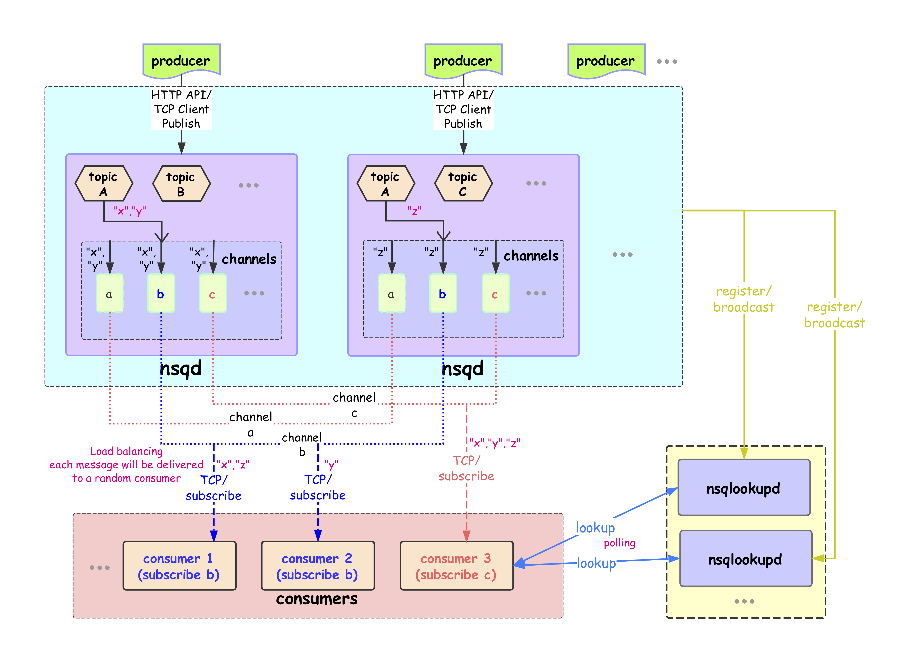

# NSQ
> NSQ是一个分布式的消息队列服务、由Go语言开发、开源、提供内置管理界面

nsq官网： https://nsq.io/ 

nsq源码： https://github.com/nsqio/nsq

## NSQ组件
NSQ 由 3 个守护进程组成:

- ***nsqd*** 是接收、队列和传送消息到客户端的守护进程。

- ***nsqlookupd*** 是管理的拓扑信息，并提供了最终一致发现服务的守护进程。

- ***nsqadmin*** 是一个 Web UI 来实时监控集群(和执行各种管理任务)。

## NSQ架构


### topic 消息的逻辑关键词
`topic`是`NSQ`消息发布的`逻辑关键词`。当程序初次发布带`topic`的消息时,如果`topic`不存在,则会在`nsqd`中创建。

### producer 消息的生产者/发布者
- `producer` 通过`HTTP API`将消息发布到`nsqd`的指定`topic`，一般有`pub/mpub`两种方式，`pub`发布一个消息，`mpub`一个往返发布多个消息。

- `producer`也可以通过`nsqd`客户端的 TCP 接口将消息发布给`nsqd`的指定`topic`。

- 当生产者`producer`初次发布带`topic`的消息给`nsqd`时,如果`topic`不存在，则会在`nsqd`中创建`topic`。

### channel  消息传递的通道
- 当生产者每次发布消息的时候,消息会采用多播的方式被拷贝到各个`channel`中,`channel`起到队列的作用。
- `channel`与`consumer(消费者)`相关，是消费者之间的负载均衡,消费者通过这个特殊的 channel 读取消息。
- `consumer`想单独获取某个`topic`的消息时，可以`subscribe(订阅)`一个自己单独命名的`nsqd` 中还不存在的`channel`,`nsqd`会为这个`consumer`创建其命名的`channel`。
- `Channel`会将消息进行排列，如果没有`consumer`读取消息，消息首先会在内存中排队，当量太大时就会被保存到磁盘中。可以在配置中配置具体参数。
- 一个`channel`一般会有多个`consumer`连接。假设所有已连接的`consumer`处于准备接收消息的状态，每个消息将被传递到一个随机的`consumer`。
- Go 语言中的 channel 是表达队列的一种自然方式，因此一个 NSQ 的 topic/channel ，其核心就是一个存放消息指针的Go-channel缓冲区。缓冲区的大小由  --mem-queue-size 配置参数确定。


### consumer 消息的消费者
- `consumer` 通过 *TCP* `subscribe`自己需要的`channel`
- `topic`和`channel`都没有预先配置。`topic`由第一次发布消息到命名`topic`的 ***producer*** 创建 ```或``` 第一次通过 ***```subscribe```*** 订阅一个命名 ***```topic```*** 的 ***consumer*** 来创建。 ***channel*** 被 ***consumer*** 第一次 ***```subscribe```*** 订阅到指定的 ***channel*** 创建。
- 多个 ***consumer***  ***```subscribe```*** 一个 ***channel*** ，假设所有已连接的客户端处于准备接收消息的状态，每个消息将被传递到一个 **```随机```** 的 ***consumer*** 。
- NSQ 支持延时消息， ***consumer*** 在配置的延时时间后才能接受相关消息。
- Channel在 ***consumer*** 退出后并不会删除，这点需要特别注意。

* ## 概述
    1. NSQ推荐通过 ***```nsqd```*** 实例使用协同定位 ***producer*** ，这意味着即使面对网络分区，消息也会被保存在本地，直到它们被一个 ***consumer*** 读取。更重要的是， ***producer*** 不必去发现其他的 ***```nsqd```*** 节点，他们总是可以向本地 ***```nsqd```*** 实例发布消息。
    2. 一个 ***producer*** 向它的本地 ***```nsqd```*** 发送消息，要做到这点，首先要先打开一个连接( NSQ 提供 ```HTTP API``` 和 ```TCP 客户端``` 等2种方式连接到 ***```nsqd```*** )，然后发送一个包含 ***```topic```*** 和消息主体的发布命令(pub/mpub/publish)，在这种情况下，我们将消息发布到 ***```topic```*** 上，消息会采用多播的方式被拷贝到各个 ***```channel```*** 中, 然后通过多个 ***```channel```*** 以分散到我们不同需求的 ***consumer*** 中。  
       
    3. ***```channel```*** 起到队列的作用。 多个 ***producer*** 产生的 ***```topic```*** 消息在每一个连接 ***```topic```*** 的 ***```channel```*** 上进行排队。
    4. 每个 ***```channel```*** 的消息都会进行排队，直到一个 ***```consumer```*** 把他们消费，如果此队列超出了内存限制，消息将会被写入到磁盘中。 ***```nsqd```*** 节点首先会向 ```nsqlookup``` 广播他们的位置信息，一旦它们注册成功， ***```consumer```*** 将会从 ```nsqlookup``` 服务器节点上发现所有包含事件 ***```topic```*** 的 ***```nsqd```*** 节点。
    5. 每个 ***```consumer```*** 向每个 ***```nsqd```*** 主机进行订阅操作，用于表明 ***```consumer```*** 已经准备好接受消息了。这里我们不需要一个完整的连通图，但我们必须要保证每个单独的 ***```nsqd```*** 实例拥有足够的消费者去消费它们的消息，否则 ***```channel```*** 会被队列堆着。


##  NSQD
...


# 参考文献

[[1]NSQ](https://github.com/AXIOMZK/NSQ/blob/master/README.md)


